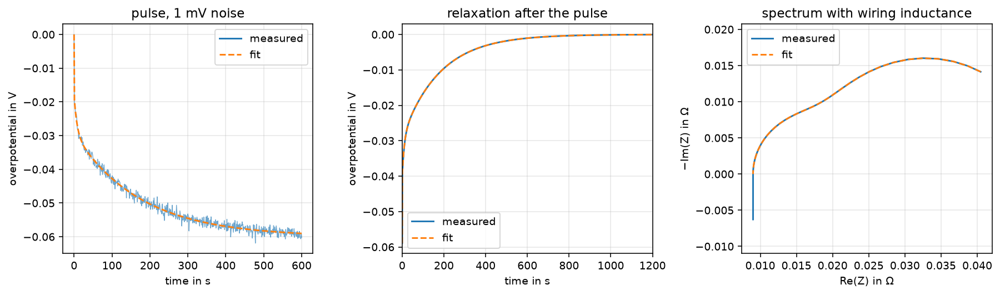

# ecmfit

[](https://github.com/count-doku/fit-battery-data/actions/workflows/ci.yml)

Identify equivalent-circuit model (ECM) parameters of a lithium-ion cell from the
three measurements a characterisation campaign actually produces: **current
pulses**, the **relaxation** that follows them, and **impedance spectra**.



An ECM is the model a battery management system can afford to run. Getting its
parameters right is a fitting problem with an awkward shape — few parameters,
strongly correlated, spanning several decades of time constant, on data where
some of them are barely observable. Most of the code here is about that shape,
not about the optimiser.

## The model

An n-th order Thevenin network: a series resistance `R0` and `n` parallel RC
elements.

```
        ┌──R1──┐   ┌──R2──┐
    ──R0┤      ├───┤      ├── ...
        └──C1──┘   └──C2──┘
```

`R0` is the instantaneous ohmic drop. Each RC element is one polarisation
process with its own time scale — charge transfer is fast, diffusion is slow.
In the time and frequency domain respectively:

$$
v(t) = R_0 I + \sum_i R_i \left(1 - e^{-t/\tau_i}\right) I
\qquad
Z(j\omega) = R_0 + \sum_i \frac{R_i}{1 + j\omega\tau_i}
$$

Elements are parameterised by their time constant $\tau_i = R_i C_i$ rather than
by $C_i$, because $\tau$ is what a measurement resolves and it keeps the
parameters on comparable numeric scales for the optimiser. Parameter vectors are
always `[R0, R1..Rn, tau1..taun]`, so the model order follows from the length of
the vector and the same functions serve a 1st, 2nd or 3rd order model.

## Install

```bash
uv sync
```

Python 3.11+, with NumPy, SciPy and Matplotlib. Plain `pip install -e .` works
too.

## Use

```python
import numpy as np
from ecmfit import OCV, ECMCell, fit_pulse

ocv = OCV(soc=[0.0, 1.0], voltage=[2.5, 4.2])  # your measured OCV curve

# Stand-in for a measurement: one resting sample, then a 10 min 1C discharge.
cell = ECMCell([0.020, 0.010, 0.030, 10.0, 180.0], ocv, capacity=1.0, soc_init=0.5)
current = np.array([0.0] + [-1.0] * 600)
t, voltage, _ = cell.simulate(current)

result = fit_pulse({"I": current, "V": voltage, "t": t}, ocv, capacity=1.0, n_rc=2)
# [2.0e-02 1.0e-02 3.0e-02 1.0e+01 1.8e+02] -> R0, R1, R2, tau1, tau2
print(result.parameter)
# 8.8e-16 V RMS: noise-free data, so the fit recovers them exactly
print(result.residual)
```

Runnable versions of all three cases are in [`examples/`](examples):

```bash
uv run python examples/fit_pulse.py
uv run python examples/fit_relaxation.py
uv run python examples/fit_eis.py
```

## What each measurement can tell you

| Function | Input | Identifies well | Identifies poorly |
| --- | --- | --- | --- |
| `fit_pulse` | current step and the voltage response | `R0`, fast RC elements | time constants longer than the pulse |
| `fit_relaxation` | the rest after a pulse | slow RC elements — nothing is driven while they decay | anything faster than the sample time |
| `fit_eis` | impedance spectrum | whatever lies inside the measured frequency band | processes outside that band; diffusion |

All three return the same [`FitResult`](ecmfit/fit.py), so results from different
domains are directly comparable. `tests/test_fit.py` asserts that a pulse fit and
an EIS fit of the same cell agree to within 1 ppm.

## Method notes

The parts that are not obvious, and why they are the way they are.

**The initial guess does most of the work.** Nelder-Mead has no gradient to
follow and a 2nd or 3rd order ECM is badly conditioned — several parameter sets
fit almost equally well. So the guesses are read off the data rather than
hard-coded: `R0` from the ohmic step, the RC resistances from the settled
overpotential minus `R0`, the time constants spread logarithmically over the
decades the measurement actually resolves. For a spectrum that last one comes
from the band where `-Im(Z)` is appreciable, since an RC element peaks there at
`f = 1/(2πτ)`; spreading guesses over the full measured range instead puts most
of them in decades the arcs never reach. Pass `p0=` to override any of it.

**Bounds are on by default.** Resistances and time constants of a passive
network are positive. Without that constraint the simplex walks into negative
time constants, where the model still evaluates and the residual still looks
small — and the parameters mean nothing. This was not a hypothetical: it is what
the unbounded version did on the spectrum in the figure above.

**Impedance residuals are weighted by `1/|Z|` by default.** Low-frequency points
are an order of magnitude larger than high-frequency ones and would otherwise
dominate the sum, fitting the diffusion tail at the cost of the charge-transfer
arc. Pass `weighting="unit"` for the raw residual.

**`R0` comes from one sample interval.** It is the only parameter identified by
a single voltage step, so everything that happens across that step lands in it —
including, in the relaxation case, the charge that moves during that interval
and shifts the OCV. Treating the relaxation OCV as one constant biased `R0` by
2.4 %; integrating it per sample brought that to 0.03 %. `hold_r0=True` pins
`R0` to the measured step instead of fitting it, for when the RC elements would
otherwise absorb part of it.

**The relaxation slice must contain the step.** `relax["I"][0]` has to be the
last sample still carrying current — otherwise `R0` is not identifiable from
that slice at all, and the function raises rather than returning a number that
looks plausible.

**Open-circuit voltage is used in both directions** — voltage to SOC to find
where a measurement sits, SOC to voltage to subtract it off. `OCV` carries both
and validates that the curve is monotonic, so it cannot be called the wrong way
round. That mistake is silent and the resulting parameters look fine.

## Real data

The synthetic cell in `ecmfit.simulate` exists so the fits can be checked against
a known answer. For real measurements, the TU Berlin degradation dataset (Neupert
2023, CC BY) contains pulse tests at several SOC over the life of 30 LG HE4 cells:

- Dataset: [doi.org/10.14279/depositonce-17598](https://doi.org/10.14279/depositonce-17598)
- Accompanying paper: [doi.org/10.3390/batteries9070364](https://doi.org/10.3390/batteries9070364)

## Limitations

Stated rather than discovered later:

- **No constant-phase or Warburg element.** Diffusion is approximated by RC
  elements, which is adequate over a limited band and wrong outside it. A
  depressed semicircle will not fit well.
- **No inductive branch.** Above roughly 1 kHz a real cell looks inductive; the
  `fit_eis` example shows what that mismatch looks like.
- **One operating point per fit.** Parameters depend on SOC and temperature.
  Fit each condition separately and build the map from the results — that is how
  the `soc` field on `FitResult` is meant to be used.
- **Nelder-Mead is a local method.** Good guesses and bounds make it reliable
  here, not immune. Check `result.success` and look at the plot.
- **OCV hysteresis is not modelled.** The OCV curve is assumed single-valued,
  which is a poor assumption for LFP.

## Development

```bash
uv run pytest        # round-trip tests: simulate known parameters, fit them back
uv run ruff check .
```

The tests are round trips rather than fixtures. A fitting routine can be wrong in
ways that still draw a convincing curve — a mis-ordered parameter vector, a sign
error on the current, a one-sample timing offset. Recovering the parameters that
generated the data catches all three, and it caught all three while this was
being written.

## References

1. S. Neupert and J. Kowal, "Model-Based State-of-Charge and State-of-Health
   Estimation Algorithms Utilizing a New Free Lithium-Ion Battery Cell Dataset
   for Benchmarking Purposes", *Batteries* 9(7):364, 2023.
   [doi:10.3390/batteries9070364](https://doi.org/10.3390/batteries9070364)
2. S. Neupert, "Lithium-Ion Battery Cell Degradation Data Set", TU Berlin
   DepositOnce, 2023.
   [doi:10.14279/depositonce-17598](https://doi.org/10.14279/depositonce-17598)
3. D. Andre, M. Meiler, K. Steiner, H. Walz, T. Soczka-Guth and D. U. Sauer,
   "Characterization of high-power lithium-ion batteries by electrochemical
   impedance spectroscopy. II: Modelling", *Journal of Power Sources*
   196(12):5349–5356, 2011.
   [doi:10.1016/j.jpowsour.2010.07.071](https://doi.org/10.1016/j.jpowsour.2010.07.071)
4. M. Franke, D. Kupfer, S. Neupert, Q. Wang, W. Li and J. Kowal, "Machine
   learning models", in *Electrochemical Power Sources: Fundamentals, Systems,
   and Applications*, pp. 131–162, Elsevier, 2026.
   [doi:10.1016/b978-0-12-819987-9.00011-1](https://doi.org/10.1016/b978-0-12-819987-9.00011-1)

## License

MIT — see [LICENSE](LICENSE).
